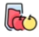

# Reporte de ejercicio 1

## Generacion de las listas
En este apartado generamos varias listas tanto desordenadas, como ordenadas

### Generacion de listas ordenadas
Para poder generar listas ordenadas es com el elemento **ol**, se pueden generar de varias maneras, ya sea para que comienzen de forma descendente o de un numero en especifico

Esta nos gtenera una lista de este estilo:
```html
<ol>
    <li>pollo 🍗</li>
    <li>pescado 🐟</li>
    <li>carne molida 🥩</li>
</ol>
```
### Generacion de listas desordenadas
Para poder generar listas desordenadas es com el elemento **ul**

Esta nos gtenera una lista de este estilo:
```html
<ul>
    <h2><li>Carnes</li></h2>
    
</ul>
```

## Creacion de apartados

### Ajuste de componentes
Dentro de esto existe una jerarquia, es como decir que un elemento pertenece a, de esta manera nos damos cuenta si es que los elementos van dentro de la etiqueta principal o si son apartados adicionales, dado que en la imagen se muestra que pertenecen a la misma jerarquia se agregaron por separado siguiendo el orden establecido.

### Apartado de imagenes
Para insertar imagenes es con la etiquetas **"img"**, esta contiene el apartado de la ruta y tambien cuenta con un apartado por si es que no se pudiera llegar a cargar la imagen **"alt"**

```html

```
### Apartado de figura
En este apartado se necesito generar uno de esta manera debido a que se requeria

```html
    <ul>
        <h2><li>Nota</li></h2>
    </ul>
    <figure>
        
        <figcaption>No olvidar las galletas de Romeo</figcaption>
        <a href="galletadog.html">galletadog</a>
    </figure>
```
### Enlaces 
Para generar enlaces se puede generar partiendo de una etiqueta **"a"** y poniendo el enclace hacia otra pagina

```html
<a href="galletadog.html">galletadog</a>
```
